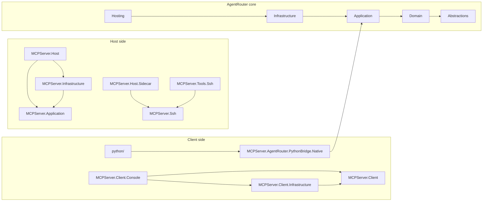

# MCPServer

MCPServer is a .NET 10 workspace for an MCP host, an SSH tool surface, AgentRouter, and a NativeAOT Python bridge.

The host runs stdio by default. Streamable HTTP is available on loopback when enabled explicitly.

Protocol baseline: MCP 2025-11-25. See [docs/SPEC_COMPLIANCE.md](docs/SPEC_COMPLIANCE.md) for the current implementation matrix.

## What ships here

- `MCPServer.Host` is the main MCP server host.
- `MCPServer.Host.Sidecar` is a small CLI for sidecar-style host launches.
- `MCPServer.Client.Console` is a local client for stdio or HTTP.
- `MCPServer.AgentRouter.*` contains the AgentRouter contracts, application layer, infrastructure, and hosting composition.
- `MCPServer.Ssh` and `MCPServer.Tools.Ssh` own SSH policy/runtime and MCP tool exposure.
- `python/` contains the `ctypes` wrapper for the NativeAOT bridge.
- `scripts/Sync-PythonBridge.ps1` publishes the native bridge, syncs the Python package payload, and can build the wheel.

## Architecture at a glance

Solid arrows point from the owning project or boundary to the dependency it uses.



## Build and test

```powershell
dotnet restore .\MCPServer.slnx
dotnet build .\MCPServer.slnx -c Debug
dotnet test .\MCPServer.slnx -c Debug
```

## Run the host

Stdio host:

```powershell
dotnet run --project .\MCPServer.Host\MCPServer.Host.csproj
```

Console against stdio:

```powershell
dotnet run --project .\MCPServer.Client.Console\MCPServer.Client.Console.csproj -- --server-path dotnet --server-arg MCPServer.Host.dll --working-directory .\MCPServer.Host\bin\Debug\net10.0 --tool server.info
```

HTTP host on loopback:

```powershell
$env:McpTransport__Http__Enabled = 'true'
$env:McpTransport__Http__Port = '3011'
dotnet run --project .\MCPServer.Host\MCPServer.Host.csproj
```

Console against HTTP:

```powershell
dotnet run --project .\MCPServer.Client.Console\MCPServer.Client.Console.csproj -- --endpoint http://127.0.0.1:3011/mcp/ --tool ssh.profiles.list
```

## Python bridge

The NativeAOT Python bridge is published separately.

The release and install path starts from .NET, then syncs the native payload into the Python package and builds the wheel. See [docs/INSTALL.md](docs/INSTALL.md).

If you only want the wrapper package layout, see [python/README.md](python/README.md).

## Where to read next

- [docs/REPO_ARCHITECTURE.md](docs/REPO_ARCHITECTURE.md)
- [docs/BUILD_AND_TEST.md](docs/BUILD_AND_TEST.md)
- [docs/INSTALL.md](docs/INSTALL.md)
- [docs/SSH_BOUNDARY.md](docs/SSH_BOUNDARY.md)
- [docs/AGENT_ROUTER_BOUNDARY.md](docs/AGENT_ROUTER_BOUNDARY.md)
- [docs/SPEC_COMPLIANCE.md](docs/SPEC_COMPLIANCE.md)
- [docs/KNOWN_DRIFT.md](docs/KNOWN_DRIFT.md)

## Repository rules

- `System.Text.Json` only
- Autofac for composition
- no MediatR
- explicit boundaries over magic dispatch
- fix the first real failure before chasing downstream metadata errors
