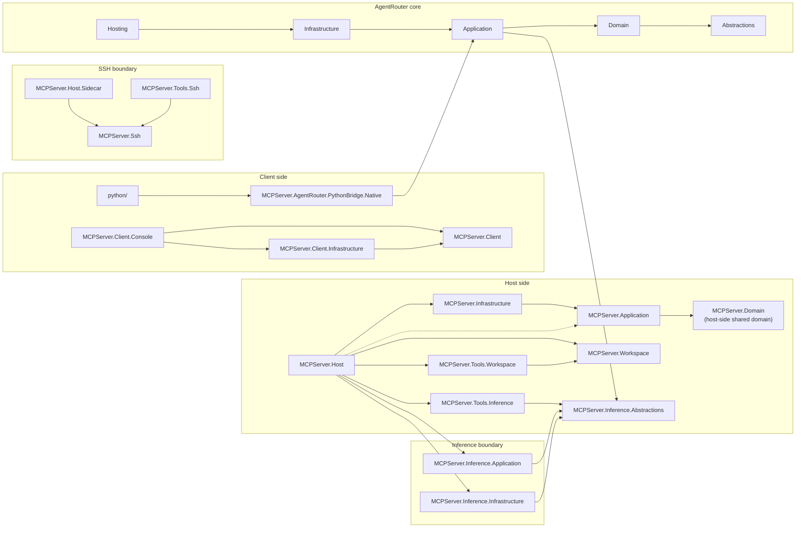

# MCPServer

MCPServer is a .NET 10 workspace for an MCP host, SSH tooling, AgentRouter, and a NativeAOT Python bridge.

The host starts stdio and loopback Streamable HTTP by default. HTTP prefers `127.0.0.1:3011` and falls back to another loopback port if that port is already in use.

Protocol baseline: MCP 2025-11-25. The current implementation matrix lives in [docs/SPEC_COMPLIANCE.md](docs/SPEC_COMPLIANCE.md).

## Agent Bubble

This repository is an explicit agent bubble, not a loose pile of tools.

- The host is the authority.
- Workspace roots and sandboxes are the bounded world.
- Console, IDE extensions, and future sub-agents are thin entry points into that world.
- Tools are capabilities inside the bubble, not ambient access to the machine.
- Policy gates, approval flow, and session state stay inside the host and do not leak into prompts.
- Workspace writes stay workspace-root scoped. No silent cross-root mutation.
- The design goal is a safe, inspectable, nested agent system: one host, many constrained workers.

If a feature weakens those boundaries, it is the wrong feature.

## Workspace map

- `MCPServer.Host` is the primary MCP server host.
- `MCPServer.Host.Sidecar` is the sidecar entry point for host composition.
- `MCPServer.Workspace` owns workspace roots, sandbox registry persistence, and workspace file policy.
- `MCPServer.Tools.Workspace` exposes the workspace MCP tool surface.
- `MCPServer.Client.Console` is the local client for stdio and HTTP checks.
- `MCPServer.AgentRouter.*` contains the AgentRouter contracts, application layer, infrastructure, and hosting composition.
- `MCPServer.Inference.*` contains the provider-neutral inference port, routing policy, and provider adapters for LMStudio, Ollama, and Anthropic.
- `MCPServer.Tools.Inference` exposes the `inference.generate` MCP tool for routing prompts through configured inference providers.
- `MCPServer.Ssh` and `MCPServer.Tools.Ssh` own SSH policy, runtime, and MCP tool exposure.
- `python/` contains the `ctypes` wrapper for the NativeAOT bridge.
- `scripts/Sync-PythonBridge.ps1` publishes the native bridge, syncs the Python package payload, and can build the wheel.
- The Visual Studio and VS Code extension scaffolds under `extensions/` are thin shells over the same bubble: they launch the console, host, and workspace dashboard, but they do not own the real behavior.

## Workspace sandboxes

Workspace editing is workspace-root scoped and shared across stdio and Streamable HTTP through a SQLite-backed sandbox registry.

- `workspace.roots.list` exposes the approved roots.
- `workspace.sandboxes.list`, `workspace.sandboxes.create`, and `workspace.sandboxes.delete` manage durable sandboxes.
- `workspace.files.read`, `workspace.files.search`, `workspace.files.write`, and `workspace.files.applyPatch` operate inside approved roots and sandboxes only.
- Sandbox operations are approval-gated.
- If no explicit roots are configured, the host walks upward from its binary directory to the nearest `.slnx`, `.sln`, or `.git` marker and exposes that checkout as the default `workspace` root. That makes Visual Studio and VS Code launches land on the opened repo instead of the output folder.
- Default paths live under `%LocalAppData%\MCPServer\workspace\workspace.db` and `%LocalAppData%\MCPServer\workspaces` unless overridden.
- This is intentional: the workspace is the agent bubble. The host decides what is in-bounds, and sub-agents inherit only the roots and sandboxes the host exposes.

See [docs/WORKSPACE_SANDBOXES.md](docs/WORKSPACE_SANDBOXES.md) for the full model.

## Architecture at a glance

Solid arrows point from the owning project or boundary to the dependency it uses. The host-side cluster is drawn as a stack so `MCPServer.Domain` stays visible; the host also directly composes `MCPServer.Application`.



## Build and test

```powershell
dotnet restore .\MCPServer.slnx
dotnet build .\MCPServer.slnx -c Debug
dotnet test .\MCPServer.slnx -c Debug
```

## Run the host

Stdio host:

```powershell
dotnet run --project .\MCPServer.Host\MCPServer.Host.csproj
```

Console against stdio:

```powershell
dotnet run --project .\MCPServer.Client.Console\MCPServer.Client.Console.csproj -- --server-path dotnet --server-arg MCPServer.Host.dll --working-directory .\MCPServer.Host\bin\Debug\net10.0 --tool server.info
```

HTTP host on loopback:

```powershell
dotnet run --project .\MCPServer.Host\MCPServer.Host.csproj
```

Console against HTTP:

```powershell
dotnet run --project .\MCPServer.Client.Console\MCPServer.Client.Console.csproj -- --endpoint http://127.0.0.1:3011/mcp/ --tool ssh.profiles.list
```

Inference smoke:

```powershell
dotnet run --project .\MCPServer.Client.Console\MCPServer.Client.Console.csproj -- --server-path dotnet --server-arg MCPServer.Host.dll --working-directory .\MCPServer.Host\bin\Debug\net10.0 --tool inference.generate --arguments '{"prompt":"Say hello in one sentence.","providerId":"lmstudio"}'
```

Chat console:

```powershell
dotnet run --project .\MCPServer.Client.Console\MCPServer.Client.Console.csproj -- --server-path dotnet --server-arg MCPServer.Host.dll --working-directory .\MCPServer.Host\bin\Debug\net10.0 --chat --provider lmstudio
```

Inside chat mode, use `/prompt`, `/tools`, `/provider`, `/model`, `/system`, `/strategy`, and `/fallback` to inspect or change the active route without leaving the REPL.
Use `/tool <name> [json]` to call any MCP tool from inside the chat loop, `/search` to use the workspace search tool, `/read`, `/write`, `/patch`, and `/edit` to reach the workspace file tools through MCP, `/compact [instructions]` to compress the transcript into retained context, and `/clear` as a friendlier alias for `/reset`.
Chat mode seeds an initial workspace context from the detected checkout root and `workspace.roots.list`, and changing `/provider` or `/model` resets the transcript while keeping that workspace context.

## IDE launch profiles

`MCPServer.Host` and `MCPServer.Client.Console` both ship `Properties/launchSettings.json` profiles for IDE launches.

- The console `chat` profile sets `MCP_WORKSPACE_ROOT=.` so Visual Studio and VS Code C# Dev Kit can open the workspace root automatically when you start the REPL from the IDE.
- The host `host` profile keeps the server launch explicit and still lets the workspace layer resolve the repo root from the launched binary path.
- The repo also ships [`.vscode/launch.json`](.vscode/launch.json), [`.vscode/tasks.json`](.vscode/tasks.json), and [`.vscode/extensions.json`](.vscode/extensions.json) wrappers so VS Code can launch, build, and recommend the C# and PowerShell tooling from the same project-owned setup.
- The repo ships [`.vsconfig`](.vsconfig) with the Visual Studio extension development workload so Visual Studio can prompt for the SDK and related prerequisites without guessing.
- If you want to override the inferred root manually, pass `--workspace-root <folder-or-solution-directory>` in stdio mode. If you pass a `.sln` or `.slnx` path, the console uses its containing directory as the workspace root.

For VS Code, the intended path is C# Dev Kit plus the project launch profiles above. The debug configs in `.vscode/launch.json` point at the `chat` and `host` profiles instead of re-specifying arguments in editor state. For Visual Studio, import `.vsconfig` if the extension workload is missing, then choose the profile you want from the project launch settings.

## IDE Extensions

If you want to build editor integrations instead of just launching the console, the repo now carries two small scaffolds under [`extensions/`](extensions/README.md):

- [`extensions/visualstudio/MCPServer.VisualStudio.Vsix`](extensions/visualstudio/MCPServer.VisualStudio.Vsix) is the shipping Visual Studio 2026-compatible VSSDK extension. It keeps the shell layer thin and pushes the workspace and launch logic into shared services.
- In Visual Studio, the extension menu appears under `Extensions > MCPServer`.
- [`extensions/vscode/mcpserver-ide-tools`](extensions/vscode/mcpserver-ide-tools) is a thin VS Code extension scaffold that opens the same repo-owned debug profiles from the command palette.
- Both IDE extensions are control surfaces for the same agent bubble. They should remain thin, explicit, and unable to bypass workspace or policy boundaries.

Use `inference.providers.list` first if you want to confirm which inference backends are enabled before you generate. Pass `{"probe":true}` when you want a live readiness ping instead of config-only listing, or use the console shortcut `--probe --probe-timeout-ms 3000` on `inference.providers.list` if you want the same thing without writing JSON by hand. For `inference.generate`, use `--provider lmstudio` or `--provider ollama` to inject `providerId` without typing it into the JSON payload yourself.

Set `McpInference` in host configuration to point LMStudio or Ollama at the local endpoints you want to test.

## Python bridge

The NativeAOT bridge ships separately.

The release and install path starts from .NET, then syncs the native payload into the Python package and builds the wheel. See [docs/INSTALL.md](docs/INSTALL.md).

If you only need the wrapper package layout, see [python/README.md](python/README.md).

## Read next

- [docs/REPO_ARCHITECTURE.md](docs/REPO_ARCHITECTURE.md)
- [docs/BUILD_AND_TEST.md](docs/BUILD_AND_TEST.md)
- [docs/INSTALL.md](docs/INSTALL.md)
- [docs/WORKSPACE_SANDBOXES.md](docs/WORKSPACE_SANDBOXES.md)
- [docs/SSH_BOUNDARY.md](docs/SSH_BOUNDARY.md)
- [docs/AGENT_ROUTER_BOUNDARY.md](docs/AGENT_ROUTER_BOUNDARY.md)
- [docs/SPEC_COMPLIANCE.md](docs/SPEC_COMPLIANCE.md)
- [docs/KNOWN_DRIFT.md](docs/KNOWN_DRIFT.md)

## Repository rules

- `System.Text.Json` only.
- Constructor injection for composition.
- No MediatR.
- No AutoMapper.
- Keep boundaries explicit.
- Fix the first real failure before chasing downstream metadata errors.

Keywords: MCP, .NET 10, NativeAOT, SQLite, SSH, Streamable HTTP, workspace sandboxes, Python bridge, VS2026.
Yoda likes the good green.
