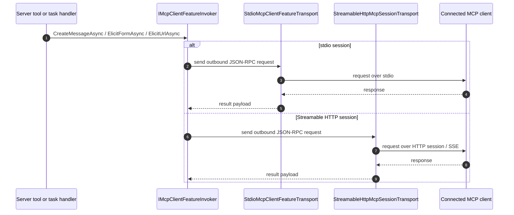

# Client Interaction Runtime

This repo now includes runtime plumbing for server-initiated client feature requests over both stdio and Streamable HTTP:

- `sampling/createMessage`
- `elicitation/create` (form and URL mode)
- `notifications/tasks/status`

Current implementation notes:

- The server can initiate client feature requests through `IMcpClientFeatureInvoker`.
- The stdio transport implements this through `StdioMcpClientFeatureTransport`.
- The Streamable HTTP transport implements the same client-feature seam through `StreamableHttpMcpSessionTransport`.
- The server exposes testable tool surfaces:
  - `client.sample`
  - `client.elicit.form`
  - `client.elicit.url`
- Server-owned task status changes are emitted through `IMcpTaskStatusNotifier`, and the client transports publish `notifications/tasks/status` when task-aware requests progress.
- The console smoke tests exercise both transports so the runtime shape stays honest.

See [docs/SPEC_COMPLIANCE.md](SPEC_COMPLIANCE.md) for the current protocol implementation matrix.
