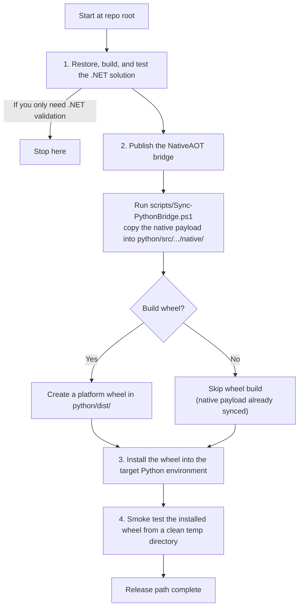

# Install and Release

This document follows the release path from .NET down into Python packaging.
It is the canonical install flow for the NativeAOT AgentRouter bridge.

## Release path

Solid arrows show the release path from repo root to a smoke-tested wheel.



## Expected environment

- .NET SDK 10.x
- Python 3.14
- PowerShell 7+
- Windows x64 for the current published bridge artifact

## 1. Build and verify the .NET solution

Start by making sure the repository builds and tests cleanly:

```powershell
dotnet restore .\MCPServer.slnx
dotnet build .\MCPServer.slnx -c Debug
dotnet test .\MCPServer.slnx -c Debug
```

If you are only validating the .NET side, you can stop here.

## 2. Publish the NativeAOT bridge and sync the Python package payload

The checked-in sync script publishes the NativeAOT shared library and copies it
into the Python package-local `native/` folder:

```powershell
pwsh .\scripts\Sync-PythonBridge.ps1 -Configuration Release -RuntimeIdentifier win-x64
```

If you want the distributable wheel at the same time, add `-BuildWheel`:

```powershell
pwsh .\scripts\Sync-PythonBridge.ps1 -Configuration Release -RuntimeIdentifier win-x64 -BuildWheel
```

The script produces a platform wheel under `python/dist/`.

## 3. Install the wheel into Python

Install the built wheel into the target Python environment:

```powershell
$wheel = Get-ChildItem .\python\dist\*.whl | Select-Object -First 1
python -m pip install --force-reinstall --no-deps $wheel.FullName
```

## 4. Smoke test the installed wheel

Run the Python smoke test from a clean working directory so you exercise the
installed artifact instead of the source tree:

```powershell
$smokeDir = Join-Path $env:TEMP 'mcpserver-wheel-smoke'
New-Item -ItemType Directory -Force -Path $smokeDir | Out-Null
Push-Location $smokeDir
try {
    Remove-Item Env:MCP_SERVER_AGENTROUTER_NATIVE_LIBRARY -ErrorAction SilentlyContinue
    @'
from mcpserver_agentrouter_bridge import AgentRouterBridge
with AgentRouterBridge() as bridge:
    response = bridge.run({
        "objective": "review the workspace",
        "metadata": {"agent.workflowMode": "deterministic"},
    })
print(response["status"])
print(response["message"])
'@ | python -
}
finally {
    Pop-Location
}
```

If the smoke test cannot locate the native library, rerun step 2 with
`-BuildWheel` and then repeat the install step.

## Notes

- The Python bridge is intentionally `ctypes`-based and JSON-first.
- The NativeAOT bridge owns the exported ABI and memory ownership rules.
- The Python package is expected to consume the synced native library from its
  local `native/` folder or from the `MCP_SERVER_AGENTROUTER_NATIVE_LIBRARY`
  override.
