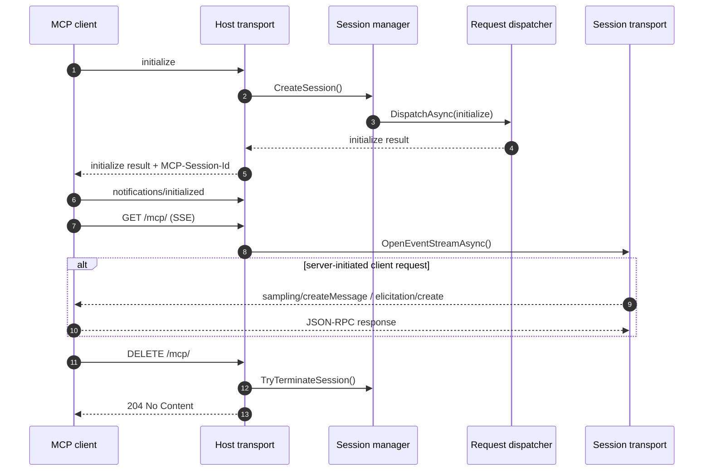

# MCP Spec Compliance

This repository tracks the current stable MCP revision `2025-11-25`.
The goal is to keep the documented protocol surface aligned with the code that actually ships in this workspace.

Official spec references:

- [Specification overview](https://modelcontextprotocol.io/specification/2025-11-25)
- [Lifecycle](https://modelcontextprotocol.io/specification/2025-11-25/basic/lifecycle)
- [Transports](https://modelcontextprotocol.io/specification/2025-11-25/basic/transports)
- [Authorization](https://modelcontextprotocol.io/specification/2025-11-25/basic/authorization)
- [Tasks](https://modelcontextprotocol.io/specification/2025-11-25/basic/utilities/tasks)
- [Elicitation](https://modelcontextprotocol.io/specification/2025-11-25/client/elicitation)

## Current implementation matrix

| Area | Status | Notes |
| --- | --- | --- |
| Base protocol | Implemented | JSON-RPC 2.0 message handling, session state, request/response correlation, and cancellation-aware dispatch are in place. |
| Lifecycle | Implemented | `initialize`, `notifications/initialized`, version negotiation, session teardown, and clean shutdown paths are implemented for both stdio and HTTP. |
| stdio transport | Implemented | stdio starts with the host and supports outbound client-feature requests, task status notifications, and graceful shutdown. |
| Streamable HTTP transport | Implemented | Loopback binding, `Origin` validation, `MCP-Protocol-Version`, `MCP-Session-Id`, `Last-Event-ID`, resumable SSE, `DELETE` teardown, and bounded replay are implemented, and the host enables HTTP by default on loopback with a preferred `127.0.0.1:3011` binding. |
| Header/body validation | Implemented | HTTP `Mcp-Method`, `Mcp-Name`, and `Mcp-Param-*` validation is enforced against the JSON-RPC body. |
| Authorization | Implemented | Protected-resource discovery, RFC 8414 / OIDC discovery, PKCE, loopback redirect handling, client-id metadata documents, dynamic client registration, bearer handling, and scope challenges are implemented for HTTP. |
| Server features | Implemented | Tools, resources, prompts, logging, completions, tasks, and workspace editing tools are exposed by the host. |
| Client features | Implemented | Sampling and elicitation are implemented, including form and URL mode elicitation. |
| Tasks | Implemented | `tasks/list`, `tasks/get`, `tasks/result`, `tasks/cancel`, and task status notifications are wired through the runtime. |
| Python bridge | Implemented | The NativeAOT bridge is exposed through a C ABI and a stdlib-only Python package wrapper. |

## Lifecycle at a glance

## Notes on scope

This repository does not attempt to implement every adjacent MCP ecosystem extension or registry workflow.
The codebase is aligned to the stable core spec and to the selected protocol surfaces it actually ships:

- transport and lifecycle
- authorization and discovery
- server features and client features
- tasks and task status propagation
- workspace editing and sandbox persistence

If a future change adds an additional MCP extension, the docs in this file should be updated first, then the code and tests should follow.
