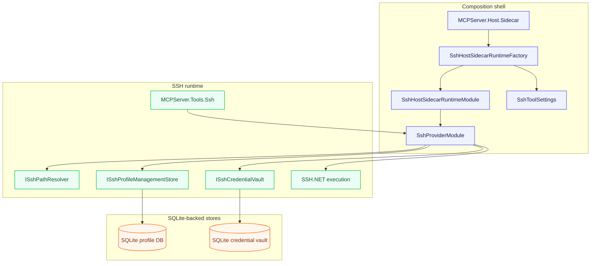

# SSH Boundary

## Ownership

`MCPServer.Ssh` owns:
- SSH runtime
- execution policy
- profile storage
- credential vault
- credential resolution
- SSH.NET execution

`MCPServer.Tools.Ssh` owns:
- MCP tool adapters only

`MCPServer.ExecutionPlugins.Ssh` owns:
- adapting SSH-backed execution into provider-neutral execution contracts

## Rules

- No SSH concerns belong in AgentRouter core packages.
- SSH must not be modeled as an AgentRouter layer.
- SSH must not depend on MCP tool abstractions for runtime behavior.

## SSH flow at a glance

Solid arrows point from the owning boundary to the component it depends on.

The sidecar is a composition shell over the SSH provider.
It should stay that way: CLI on the outside, provider runtime and SQLite-backed stores in `MCPServer.Ssh`, and MCP tool exposure in `MCPServer.Tools.Ssh`.
