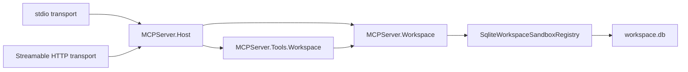

# Workspace Sandboxes

The workspace layer gives MCP clients a narrow file-editing surface without turning the server into a machine-wide filesystem API.

This repository treats that workspace as the agent bubble: the host decides what is in-bounds, and all client, IDE, and sub-agent activity stays inside the roots and sandboxes the host exposes.

## What owns what

- `MCPServer.Workspace` owns workspace roots, sandbox persistence, path resolution, and file policy.
- `MCPServer.Tools.Workspace` exposes the MCP tool surface only.
- `MCPServer.Host` composes the workspace module and transports.
- Both stdio and Streamable HTTP see the same sandboxes as long as they point at the same SQLite database path.

## Tool surface

The current tool set is intentionally small:

- `workspace.roots.list`
- `workspace.sandboxes.list`
- `workspace.sandboxes.create`
- `workspace.sandboxes.delete`
- `workspace.files.read`
- `workspace.files.search`
- `workspace.files.write`
- `workspace.files.applyPatch` requires a message that explains the patch

That is enough for a VS extension or agent workspace to inspect roots, create a disposable sandbox, edit inside it, and tear it down again.

When `McpWorkspace:Roots` is empty, the host auto-detects a checkout root by walking upward from `AppContext.BaseDirectory` until it finds a `.slnx`, `.sln`, or `.git` marker, then exposes that as the default `workspace` root.

When the client is launched through an IDE profile, the console can also seed `MCP_WORKSPACE_ROOT` from launch settings so the host sees the intended folder or solution root without guessing from the output directory. The repo's `.vscode/launch.json` uses those same project profiles, and `.vsconfig` is present for Visual Studio extension-development setup.

## Persistence model

Sandbox state is stored in SQLite, not in memory.

- Default database path: `%LocalAppData%\MCPServer\workspace\workspace.db`
- Default sandbox base path: `%LocalAppData%\MCPServer\workspaces`
- Both paths can be overridden through `McpWorkspace:Sqlite:DatabasePath` and `McpWorkspace:SandboxBasePath`
- The same registry is visible to every host instance that points at the same database path

That means a sandbox created over HTTP is still visible to a later stdio session, and vice versa.
That shared registry is part of the bubble boundary, not a convenience cache.

## Security boundaries

- Sandbox operations are approval-gated.
- Workspace roots are explicit and scoped.
- Sandbox names are normalized to filesystem-safe segments.
- Build and tool noise directories such as `.git`, `.vs`, `bin`, `obj`, and `node_modules` are excluded from sandbox copies.
- File reads, searches, writes, and patches stay inside the approved workspace boundary.
- If a flow wants to step outside that boundary, the flow is wrong and needs to be reworked.

## Example flow

The same registry and the same tool logic are used regardless of transport.

## Release and run notes

- Configure `McpWorkspace:ApprovalToken` on the host before using sandbox create or delete operations. The sandbox tools consume that host-side token internally and do not require the model or caller to pass it through the tool request.
- Keep the SQLite database on local storage owned by the host machine.
- If you move the database path, move it deliberately and keep the workspace roots aligned with the same trust boundary.
- Use `docs/INSTALL.md` for the .NET-first release flow and `README.md` for the quick-start commands.
